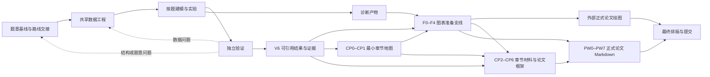

# C 题后半程顶层设计

> 状态：数据、建模、验证、图表准备、论文准备和正式论文 Markdown 写作已实现；正式绘图、引用检索、排版与最终提交仍由后续/外部模块负责。

## 1. 目标与入口

后半程接收前半程的三个核心输入：

- `synthesis/problem-baseline.md`：每问要回答什么、做到多少、题间如何串联；
- `routes/route-handoff.md`：暂定主路线、挑战路线、模型族、切换与重开条件；
- `inputs/source-manifest.json`：原始材料版本、路径和哈希。

后半程负责把暂定路线转化为可复现的数据、模型、结果、图表准备材料与论文证据，但不能静默改写题意基线。若执行中发现目标不可构造、接口失效或路线必须制造关键标签，应回到最早受影响的前半程判断。

## 2. 总体组织原则

采用：

> 模块分开，证据贯通，按问题纵向推进。

具体含义：

1. 数据、建模、验证、图表准备和论文分别承担不同责任，不由一个 Agent 从头包办；正式论文图绘制在外部模块完成。
2. 各模块共享一条证据主线，使论文中的数字、公式、图表和结论能够追溯到数据版本、代码与实验。
3. 实际执行按题间依赖组织纵向切片；共享数据基础只建立一次，各问再按题链顺序或可并行关系推进。
4. 建模过程中记录工程文稿，但不同时撰写正式论文；结果稳定后再整理章节材料包并统一成文。
5. 不使用语义硬门禁。机械事实可检查，语义判断仍依赖独立复核、反例、证据和可回退决策。

## 3. 七个后半程模块

### 3.1 数据工程

**实现状态：数据工程模块框架已实现。** 详细职责、D0–D5、数据分层和回滚见 [data-engineering.md](data-engineering.md)；团队配置见 [data-team.json](data-team.json)；角色 prompt 位于 `prompts/data-engineering/`；开放模板位于 `templates/data-engineering/`；实际派工与跨模块交接以 [根 AGENTS.md](../AGENTS.md) 为准。具体题目的管道代码和处理后数据仍由每次 run 的 D3 实现者生成，不属于仓库预置答案。

负责把原始附件转化为可供各问建模的数据基础，重点保证对象、主键、粒度、时间和单位与题意基线一致。

主要责任：

- 建立字段字典和数据生成机制理解；
- 明确分析单位、主键、时间轴、单位和连接关系；
- 记录删除、填补、聚合、派生、异常处理和样本筛选；
- 识别结构性零值、重复测量、proxy、标签和可用时点；
- 生成可复现的处理代码、处理后数据版本和质量报告；
- 说明数据支持什么、不支持什么，以及哪些处理会改变结论。

数据模块不能因为某个模型需要某种输入，就静默制造题面没有支持的标签、目标量或分析单位。模型若提出新数据需求，必须留下变更理由和对题意、其他问题及既有结果的影响。

### 3.2 建模与实验

**实现状态：建模构建模块已实现。** 设计见 [modeling-construction.md](modeling-construction.md)，实施记录见 [modeling-implementation-plan.md](modeling-implementation-plan.md)，团队配置见 [modeling-team.json](modeling-team.json)，角色 prompt 位于 `prompts/modeling/`，开放模板位于 `templates/modeling/`。该模块止于向独立验证交接候选模型与证据，不把正式模型测试混入构建模块。

负责按问题和题间依赖实现路线，形成候选模型、实验、结果与失败记录。

主要责任：

- 先固定当前问题的目标量、状态量、决策量、约束和输出；
- 建立可解释 baseline，再实现暂定主模型与必要备选；
- 保留公式、变量、假设、参数、求解设置和数据版本；
- 记录实验目的、对照、结果、异常、失败和路线切换理由；
- 产生机器可复现的结果表和诊断产物；
- 说明本问结果怎样被下一问消费。

建模不是单一“最终模型”的生成过程。被否决的路线、无效特征、不可行约束和失败实验都可能解释最终选择，不能只保存获胜结果。

### 3.3 独立验证

**实现状态：独立模型验证模块已实现。** 设计见 [model-validation.md](model-validation.md)，团队配置见 [validation-team.json](validation-team.json)，角色 prompt 位于 `prompts/validation/`，开放模板位于 `templates/validation/`。该模块止于 `validation/validation-handoff.md`，按具体主张授权可引用证据，不进入绘图或论文。

验证是独立模块，不完全由模型实现者自我检查。它负责判断候选结果是否可信、可复现、可消费，以及是否真正回答题目。

主要责任：

- 数据泄漏、目标泄漏和信息可用时点检查；
- 数学定义、公式实现、约束和可行性核对；
- 训练/验证划分、对照、敏感性、稳健性和边界条件检查；
- 随机性、参数、求解器与运行环境的复现检查；
- 结果表、代码、图表和文字结论的一致性检查；
- 上游结果能否按粒度、单位和时间被下游实际消费；
- 明确候选结果的适用边界、失效条件和需要回滚的位置。

验证发现问题后，可以要求局部修正数据、模型或图表；若问题来自题意或路线结构，则回到前半程对应 checkpoint，而不是只替换算法。

### 3.4 V6 后异步图表准备

**实现状态：图表准备支线已实现。** 详细调度见 [figure-preparation.md](figure-preparation.md)；机械配置见 `figure-preparation-team.json`；角色 prompt 位于 `prompts/figure-preparation/`；开放模板位于 `templates/figure-preparation/`。该支线在 `validation/validation-handoff.md` 后由 Leader 异步启动，不阻塞章节材料和论文框架的其他工作。

图表准备只负责“应不应该画、用哪些已授权数据、推荐什么图、放在论证的什么位置”，不负责把论文图画出来。它分为两类证据，但两者都由 subagent 整理：

- **诊断图**：服务数据理解、模型诊断、残差、稳定性、约束冲突和异常排查，保留输入、代码、预览、观察和可能的 change request；可以粗糙，不做审美迭代；
- **论文图准备包**：服务一个明确 claim，从已验证结果导出逐图数据、来源说明、推荐图型、必要标注、caption 骨架和论文逻辑位置；不产生正式图片。

该支线按 F0 冻结、F1 逐问 Curator、F2 流式 Evidence Auditor、F2R 原 Curator 回应、F3 跨问/章节位置整合、F4 交接执行。F3 Integrator 是 `figure-plan.md` 与 `figure-preparation-handoff.md` 的唯一内容 owner；F4 Leader 只核对条件、处理回滚和宣布汇合。诊断图不能直接晋升为论文图；外部绘图模块必须从验证授权的数据包重新绘制。数据、筛选、聚合、单位或 claim 发生改变时，必须返回上游，而不是在绘图阶段修饰掩盖。

### 3.5 章节材料与论文框架准备

**实现状态：CP0–CP6 已实现。** 设计见 [paper-preparation.md](paper-preparation.md)，配置见 `paper-preparation-team.json`，角色 prompt 位于 `prompts/paper-preparation/`，开放模板位于 `templates/paper-preparation/`。

该模块把验证后的工程证据整理成可直接成文的逐问材料和段落级框架。它先形成最小章节地图供图表 F3 使用，再执行逐问材料整理、独立证据审查、全篇整合和双遍竞赛成文审读。第一遍审读隔离国奖论文蒸馏，第二遍才把蒸馏作为结构与表达镜头。

模块停止于 `paper-prep/paper-framework-handoff.md`，不生成完整论文、正式图片、排版、参考文献检索结果或提交包。

### 3.6 正式论文写作

**实现状态：PW0–PW7 已实现。** 设计见 [paper-writing.md](paper-writing.md)，配置见 `paper-writing-team.json`，角色 prompt 位于 `prompts/paper-writing/`，开放模板位于 `templates/paper-writing/`。

该模块消费 paper framework 与 figure handoff。每问 subagent 写独立正式章节，主 Leader 是唯一全文作者，负责公共章节、摘要结论、组装和统一文风；四个独立 Reviewer 分别审事实、竞赛表达、全文连贯和 AI/口水文风，Reviewer 不直接修改正文。

主要责任：

- 建立全文主线和各问之间的叙事关系；
- 统一符号、术语、数据口径、模型名称和图表编号；
- 将章节材料包扩写为问题分析、模型假设、建立、求解、结果和评价；
- 确保每个关键数字、公式、图和结论都能回到工程产物；
- 处理摘要、结论、优缺点、推广与篇幅分配；
- 最后复核正文、结果文件、答卷和代码的一致性。

模块停止于 `paper-writing/formal-paper-handoff.md`。Markdown 是唯一正文源；不生成 Word/LaTeX、正式图片、引用检索、排版或提交包。Leader 不能为了叙事顺滑修改已经确认的数字或假设。

### 3.7 最终交付

最终交付模块尚未实现。它负责正式图回填、参考文献核实、Word/LaTeX/PDF 排版、匿名与页数检查、答卷和提交包，以及论文—图表—结果—代码的一致性终审。

## 4. 运行主链与反馈

具体执行顺序：

1. 接收前半程路线交接；
2. 建立共享数据基础；
3. 按题间依赖依次或并行完成各问题的纵向切片；
4. 每问同步形成实验记录、结果表和诊断图；
5. 核对跨问题接口并进行独立验证；
6. 修正、切换路线或局部回滚；
7. 确认可引用的结果和证据；
8. V6 后同时启动图表准备 F0 和论文准备 CP0；
9. CP1 先提供最小章节地图，图表 F3 与逐问章节材料随后并行；
10. 完成图表交接和 CP4–CP6 双层审查后的论文框架交接；
11. PW0–PW7 生成正式论文 Markdown，并完成四类独立审查；
12. 由后续模块完成正式图、引用、排版和最终提交一致性检查。

## 5. 贯穿全程的证据主线

后半程所有模块共享一条证据主线，但不把语义内容压入固定 JSON schema。建议至少保留以下开放 Markdown 记录：

- 数据处理记录：原始到处理后数据的变化、理由与影响；
- 建模规格：变量、公式、约束、假设、数据接口和预期输出；
- 实验记录：目的、数据版本、代码、配置、观察、异常和下一步；
- 结果索引：候选结果、适用条件、来源实验和下游用途；
- 验证记录：检查内容、反例、复现情况、限制和回滚建议；
- 图表准备索引：诊断图输入/代码、逐图数据导出、来源结果表、推荐图型、论文位置和图注方向；
- claim-evidence map：论文关键主张与数据、模型、实验、结果、图表之间的对应关系。

这些是最低留档责任，不是输出白名单。任何不能放入既有分类、但会改变结论或论文表述的发现，都应完整保留。

JSON 仍只用于路径、哈希、版本、任务状态和运行参数等机械信息。

## 6. 建模过程中需要留给论文的内容

### 数据阶段

- 数据来源、对象、时间范围、单位和粒度；
- 缺失、异常、重复、筛选、聚合和派生处理；
- 每项处理的理由及其影响规模；
- 最终数据版本和不可回答边界。

### 建模阶段

- 当前问题的数学对象、变量表、公式、目标与约束；
- 模型假设及其题面、数据或领域依据；
- baseline、主模型、备选和拒绝理由；
- 参数、求解或训练设置；
- 题间输入输出接口；
- 失败实验和模型适用边界。

### 结果与验证阶段

- 精确结果表，而不是只保存截图；
- 结果对应的数据和代码版本；
- 对照、敏感性、稳健性和边界检查；
- 不确定性、限制和可能翻转结论的条件；
- 可以支持哪些论文主张，不能支持哪些主张。

### 图表准备阶段

- 诊断图的目的、输入、生成代码、观察和版本；
- 逐图论文数据包、来源结果表、筛选条件、聚合、粒度和单位；
- 推荐图型、备选图型、必要编码/标注、逻辑位置和相邻表格关系；
- caption 骨架、关键读图结论、限制和不应过度解释的部分。

正式论文绘图代码和图文件不属于主 harness 的留档责任，由外部绘图模块另行保存。

## 7. 三层写作策略

### 第一层：执行时写工程记录

建模同时记录决策、公式、实验、结果、失败和风险。不追求论文文风，但必须让后来者能够复现并理解“为什么这样做”。

### 第二层：结果稳定后整理章节材料包

每问形成可供论文 Agent 使用的材料包，至少包含：方法说明、变量与公式、假设、结果表、论文候选 Figure ID、图表准备包、图注方向、稳健性、限制和来源索引。图表准备支线可以与章节材料包并行；正式论文图在外部模块完成后再回填最终文件。

章节材料包不是完整论文，但应达到论文 Agent 无需重新猜测代码意图即可准确成文。

### 第三层：证据稳定后统一写正式论文

此时再处理全文叙事、章节衔接、符号统一、摘要、结论、优缺点和篇幅。模型或结果发生变化时，应先更新工程记录和章节材料包，再修改论文。

总原则：

> 边做边记录，阶段结束整理，证据稳定后成文。

## 8. Agent Team 顶层结构

后半程继续使用一个 Leader，不为每个模块复制前半程六角色结构。W/D/M/V 保持既有最多三个并发 worker；V6 后图表、论文准备和正式写作逐问任务按独立写入路径并行，不设固定数字上限。

按单个问题或共享任务，常用三类视角：

1. **实现者**：负责数据处理或模型实现；
2. **图表 Curator**：负责逐问诊断、论文数据包、图型建议和章节位置；
3. **独立验证者**：检查数据、数学、复现、稳健性或图表证据一致性。
4. **章节材料 Curator**：把验证后的工程证据整理成可直接成文的逐问材料。
5. **正式章节 Writer**：把逐问材料写成连续竞赛论文正文；不拥有全文主稿。

图表准备还会在 F3 创建独立的 Figure–Chapter Integrator；它只整合 Figure ID、章节位置和论证关系，不绘图、不修改论文正文。

论文准备使用独立 Evidence Auditor 检查事实，再用 fresh-context Competition Manuscript Reviewer 检查竞赛成文性；两种审查不能合并为一个角色。全篇 Integrator 不拥有逐问事实的修改权。

正式写作由 Leader 独占全文主稿；四个独立 Reviewer 分别检查事实、竞赛表达、全文连贯和 AI/口水文风，全部只写修改单。AI 文风审查不使用检测分数、机械脚本或自动改写。

新方案和独立复核使用新 subagent；对自己旧实验的解释、修正和材料整理可以复用原 subagent。Leader 负责题间依赖、版本关系、证据主线、回滚范围和最终合成。

实际角色数量按任务风险决定，不要求每一步占满三个槽位。

## 9. 模块交接原则

### 前半程 → 数据工程

交接题意基线、路线交接、每问分析单位、目标量、题间接口、数据风险和禁止默认事项。

### 数据工程 → 建模

交接处理后数据版本、字段字典、主键/粒度/单位、处理记录、数据质量问题和禁止使用的信息。

### 建模 → 验证

交接模型规格、代码入口、配置、数据版本、结果表、诊断图、已知失败和作者自己的不确定判断。

### 验证 → 图表与章节材料

交接可引用结果、适用条件、限制、仍开放的问题，以及哪些 claim 可以或不可以成立。

### 图表与章节材料 → 论文框架

交接公式、结果表、Figure/Table 占位、claim-evidence 对应、限制和全部来源路径，形成 `paper-framework-handoff.md`。后续正式论文模块不得脱离这些证据重新生成数字。

### 论文框架 → 正式论文 Markdown

逐问 writer 只写独立 section，Leader 写公共章节、摘要结论和唯一全文主稿；四类独立 review 后形成 `formal-paper-handoff.md`。后续排版模块不得改动已冻结事实。

以上只规定最低交接内容。每个模块仍使用开放式 Markdown memo，可补充任何新的结构、异常和风险。

## 10. 局部回滚

后半程不默认全盘重做：

- 字段解释或处理错误：回到数据版本，并标记受影响实验、结果和图表；
- 模型结构不成立：回到对应问题的模型规格，保留不受影响的数据基础；
- 跨问接口失效：回到最早产生该接口的上游问题；
- 题意或路线假设被推翻：重开前半程对应判断；
- 图表建议或数据包表达错误但结果正确：只重做对应 package、recommendation 和外部图；
- 论文叙述与证据不一致：修正文稿，不允许反向修改结果迎合叙述。

旧版本、失败实验和被替换的 memo 不删除，通过新版本和来源索引说明当前使用哪一版。

## 11. 实现状态与后续顺序

当前状态与后续顺序：

1. **已实现：** 数据工程工作流、D0–D5 调度、完整/精简模式、角色 prompt、开放 Markdown 模板和机械辅助；
2. **已实现：** 建模构建 M0–M6、动态 M4 调整循环、角色 prompt、开放模板、目录初始化和可选 prompt 拼装；
3. **已实现：** 独立模型验证 V0–V6、三视角审计、动态 probe、暴露账本、主张裁决和局部回滚；
4. **已实现：** V6 后异步图表准备 F0–F4、逐问 Curator、流式独立复核、跨问章节位置整合和图表准备交接；
5. **已实现：** 论文准备 CP0–CP6、逐问材料、独立证据审查、双遍竞赛审读和论文框架交接；
6. **已实现：** 正式写作 PW0–PW7、逐问正文、Leader 全文组装、四类独立审查和 Markdown 论文交接；
7. **外部处理：** 正式论文图绘制、审美评价、视觉迭代和样式管理不属于本 harness；
8. **待实现：** 引用核实、Word/LaTeX/PDF 排版、答卷和最终提交工作流；
9. **待实现：** 全链路一致性与历史 C 题回放。

## 12. 仍未实现的内容

数据工程、建模构建、独立验证、图表准备、论文准备和正式写作之后，目前仍未实现：

- 引用核实、Word/LaTeX/PDF 排版、答卷和提交角色；
- 全链路一致性审查与历史 C 题回放；
- 具体题目的模型、求解代码、结果、正式图片、排版文件和答卷。

正式论文图的绘制、审美评价和视觉迭代由外部模块负责；正式写作只在 `paper-writing/formal-paper-handoff.md` 交接 Markdown 正文与审查状态。
